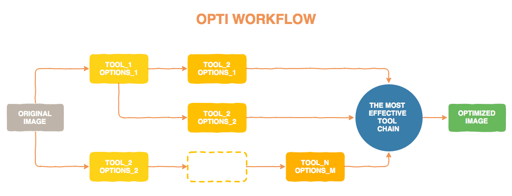

# Opti - decreases your image size

It is tool, written in PHP, which one can optimize images using various chains of tools and selects the best one for each image.

Can be used as includable component or as a standalone tool.

## Workflow

## Usage

Simple usage  
`./bin/opti optimize data/1.jpg`

Using stdin\stdout  
`cat original.svg | ./bin/opti optimize > optimized.svg`

With glob  
`./bin/opti optimize data/*.jpg`

Or maybe just files modified within the hour  
`find ./data/t/ -newermt $(date +%Y-%m-%d -d '1 hour ago') -type f | xargs php ./bin/opti optimize`  
or  
`find ./data/t/ -newerct '1 hour ago' -type f |  -type f | xargs php ./bin/opti optimize`

## Commands

| Command | Description |
| --- | --- |
| optimize | Main command which make a magic. It is optimize single file or set of files. |

## `optimize` command options

| Option | Description |
| --- | --- |
| `--config` (`-c`) | Path to custom config file to load |
| `--verbose` (`-v` \\ `vv` \\`vvv`) | Increase the verbosity of messages: 1 for normal output, 2 for more verbose output and 3 for debug. |
| `--no-colors`  | Force no colors in output |
| `--out` (`-o`)  | Path to file or directory.  In case batch mode output path must be directory only, in single mode can be directory or path to file.   **Note**, that path must be writable and all directories must be exist.  For STDIN can be specified only path to file.  |

## Supported tools from the box
**Note** than you can specify your custom tool using _YAML_ config file.

### convert
https://www.imagemagick.org/script/convert.php

### Jpegoptim
https://github.com/glennr/jpegoptim

### guetzli (Google)
https://github.com/google/guetzli

Install on Mac OS
`brew install guetzli`

### pngquant
https://pngquant.org/

Install on Mac OS
`brew install pngquant`

### optipng 
http://optipng.sourceforge.net/

Install on Mac OS
`brew install optipng`

### svgo 
https://github.com/svg/svgo

Install on Mac OS
`npm install -g svgo`

### svgcleaner
https://github.com/RazrFalcon/svgcleaner

Install  
Clone repo and build using cargo as described in repo readme

Install on Mac OS
`brew install svgcleaner`

## Configuration file example

    opti:
      scenarios:
        JPEG:
          - convert:jpeg85, jpegoptim:default
          - jpegoptim:jpeg85
          - guetzli:default
        PNG:
          - pngquant:default
          - optipng:default
          - pngquant:default, optipng:default
        SVG:
          - svgo:default
          - svgcleaner:default
      tools:
        convert: # https://www.imagemagick.org/script/convert.php
          bin: convert
          template: '{options} {input} {output}'
          configs:
            default:
              - '-strip'
            jpeg85:
              - '-sampling-factor 4:2:0'
              - '-strip'
              - '-quality 85'
        jpegoptim: # https://github.com/glennr/jpegoptim
          bin: jpegoptim
          template: '{options} {input} --stdout > {output}'
          configs:
            default:
              - '-s'
            jpeg85:
              - '-p'
              - '-s'
              - '-m85'
        guetzli: # https://github.com/google/guetzli
          bin: guetzli
          template: '{options} {input} {output}'
          configs:
            default:
              - '--quality 85'

## TODO
* Documentation
* More tests
* More tools
* ~~Move internal configurations to file~~ DONE
* ~~Command option for setting log level~~ DONE
* ~~Ability to read external config file~~ DONE
* ~~Allow to register new tools on the fly~~ DONE
* ~~Read from stdin, output to stdout~~ DONE
* Config lint command https://symfony.com/doc/current/components/yaml.html#syntax-validation
* Dummy config create command
* Tool options replacements, i.e. {quality}
* ~~Build Phar file~~ DONE
* ~~Output dir option~~ DONE
* Tinypng web service integration
* Dry-run mode
* Installed tool detection command
* Batch optimize statistics
* Backup of original files (declare directory)
* Global settings (maybe in home directory)
* Install tools command
* ...

## Other info

### png
* https://pngmini.com/ > https://pngquant.org/

### jpeg
* https://github.com/mozilla/mozjpeg
* https://github.com/technopagan/adept-jpg-compressor
* jpegtran

### Articles
* https://addyosmani.com/blog/image-optimization-tools/
* http://www.tecmint.com/optimize-and-compress-jpeg-or-png-batch-images-linux-commandline/
* http://optipng.sourceforge.net/pngtech/optipng.html
